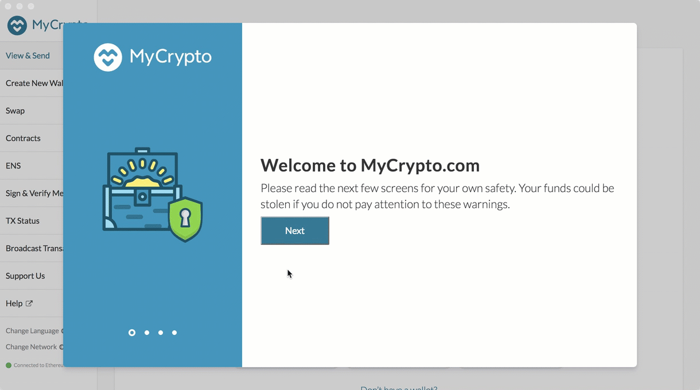

# Proof of Authority Development Chain Project
## Project Mission Statement: 
---
### Team - I am so excited to be finally presenting you with an exciting project.  This project will allow ZBank to reiterate its stated purpose to the rest of the Fintech industry: To be cutting edge in the technology and processes that it seeks to aline itself with on a daily basis.

---
### We are going to set up a private testnet blockchain in order to show the abilities of the technology to process transactions in a more efficient manner than the industry does so right now. In using a testnet Blockchain, we will be using seeking to hone in on the specific method in which we will utilize the blockchain technology. We will use the consensus algorithm "Proof of Authority (POA)." I think that a main benefit of using testnet is that the is no real money involved and because that is the case - our team of engineers will be able to focus more on being creative in its approach and less worried about the level of money gained as being the main goal.

### In additon, POA is a good algo for out team because it is cheap as it doesnt use a lot of computing power and is a centralized algo which will allow for offline development.  As such, it is a rather ideal algo for us to use in development and testing.	I think it would be besst if we used a documented step-by-step process for all interested parties in the bank to peruse so that if we are convincing in our presentation perhaps the bank will seek to adopt blockchain technology. Ok team - let's get started!	
---

### First we will need to A) install a the "Mycrypto Desktop App" software and b) Install "Go Ethereum Tools"

### A) MyCrypto Installation Notes

General Notes:

* The first time you execute MyCrypto, you will see the following starting tutorial, we suggest to read trough as you click "Next" to continue.

 

Running in OS X:

* The first time you execute MyCrypto, you will see the following warning message, you can safely click on the "Open" button to start the application.

 

### Allowing Permission to Open Apps from Unidentified Developers

When an app is not registered with Apple, it can be automatically blocked by the Mac OS operating system when attempting to open the "unidentified" application. Therefore, in order to allow the use of the MyCrypto app, you may need to allow it as an exception to your Mac OS security preferences. To do so perform the following.

1. Open the MyCrypto app, it should produce a warning error saying that you cannot open the application due to security reasons. Therefore, we'll need to make a security exception for it.

2. Look to the top-left of the screen and click on the Apple Logo and navigate to System Preferences > Security & Privacy.

    

3. Click in the General tab and allow your MyCrypto application security access to be opened in the "Allow Apps Downloaded From" section. Your screen should look similar to the image below.

    

---
## B) Installing Go Ethereum Tools

[Go Ethereum](https://geth.ethereum.org/) is one of the three original implementations of the Ethereum protocol. It is written in Go, fully open-source and licensed under the GNU LGPL v3.

In this Unit, we will use Go Ethereum Tools to create our very own blockchain, from the genesis block to mining tokens and making transactions.

Despite there are installers for OS X and Windows, we will use the application executable binary files to have a seamless experience between both operating systems and avoid some technical issues that currently exist in Windows.

To install the Go Ethereum Tools, please follow the next steps:

1. Open your browser and navigate to the Go Ethereum Tools download page at https://geth.ethereum.org/downloads/

2. Scroll down to the "Stable Releases" section and proceed depending on your operating system.

 2.1. Installing in OS X.
 Click on the **"Geth & Tools 1.9.7"** to download the applications bundle archive.
 

 2.2. Installing in Windows.
 
 You need to know if you are running a `32 bit` or `64 bit` version of Microsoft Windows, if you are not sure about that, you can check your version following [these steps](https://support.microsoft.com/en-us/help/13443/windows-which-version-am-i-running).

 Depending on your Windows version, you should download the `32 bit` or `64 bit` version of the Go Ethereum Tools.

3. After downloading the tools archive, open your "Downloads" folder, and you will find a file named `geth-alltools-darwin-amd64-1.9.7-a718daa6.tar.gz` in OS X, and a file called `geth-alltools-windows-amd64-1.9.7-a718daa6.zip` in Windows. Note that the last numbers in the filename could vary depending on the last built available.

4. Decompress the archive in the location of your preference in your computer's hard drive, and rename the containing folder as `Blockchain-Tools`. We recommend using a location that can be easily accessed from the terminal window like the user's home directory.

 

5. OK team! You have finished the installation process; we will use these tools to create our very own Proof of Authority Development BlockChain
!
---
# Running a Proof of Authority Blockchain

The Proof of Authority (PoA) algorithm is typically used for private blockchain networks as it requires pre-approval of, or voting in of, the account addresses that can approve transactions (seal blocks).  

1. Because the accounts must be approved, we will generate two new nodes with new account addresses that will serve as our pre-approved sealer addresses.

    * Open up a Gitbash (assuming u are using windows) and cd into BC-ToolsHW and create 2 new nodes and jot down the public key and secret key addresses.

    * Create accounts for two nodes for the network with a separate `datadir` for each using `geth`. IN your terminal type:
        * ./geth --datadir node1 account new
        * ./geth --datadir node2 account new

        * let's use "lala" as the Password when prompted when creating each node. After we do that for each node, there will be an output for a public address key and Path for a secret key.

        * Node 1: Public address of the key:   0x16567359CF514fD011aa6F54F241C735bc42c4E6
            Path of the secret key file: node1\keystore\UTC--2020-11-04T23-45-29.763790400Z--16567359cf514fd011aa6f54f241c735bc42c4e6
        
        * Node 2: Public address of the key:   0x2E4616E7B34BF8A0B7eA6Be291Ed578277c3F9a3
        Path of the secret key file: node2\keystore\UTC--2020-11-04T23-46-09.011600600Z--2e4616e7b34bf8a0b7ea6be291ed578277c3f9a3

2. Next, generate your genesis block.

    * Run ./puppeth, and let's name our network "vaultone", and select the option to configure a new genesis block. Then select to create a new genesis from scratch.

    * Choose the `Clique (Proof of Authority)` consensus algorithm.

    * Paste both account addresses from the first step one at a time into the list of accounts to seal.

    * Paste them again in the list of accounts to pre-fund. There are no block rewards in PoA, so you'll need to pre-fund.

    * You can choose `no` for pre-funding the pre-compiled accounts (0x1 .. 0xff) with wei. This keeps the genesis cleaner.

    * Add a Chain ID. It can be any random number. Let's choose 777.

    * Complete the rest of the prompts, and when you are back at the main menu, choose the "Manage existing genesis" option.

    * Export genesis configurations. This will fail to create two of the files, but you only need to keep `vaultone.json`. * Feel free to delete the other Json files that were created.

3. With the genesis block creation completed, we will now initialize the nodes with the genesis' json file.

    * Using `geth`, initialize each node with the new `networkname.json`.
        * ./geth --datadir node1 init vaultone.json
        * ./geth --datadir node2 init vaultone.json

4. Now the nodes can be used to begin mining blocks.

    * Run the nodes in separate terminal windows with the commands:

    * node 1:

        * ./geth --datadir node1 --unlock "SEALER_ONE_ADDRESS" --mine --rpc --allow-insecure-unlock
        
        * Using that Node 1 address: 0x16567359CF514fD011aa6F54F241C735bc42c4E6

        * ./geth --datadir node1 --unlock "0x16567359CF514fD011aa6F54F241C735bc42c4E6" --mine --rpc --allow-insecure-unlock

        * If this doesn't work try:

        * ./geth --datadir node1 --unlock "0x16567359CF514fD011aa6F54F241C735bc42c4E6" --mine --minerthreads 1 --rpc --allow-insecure-unlock --syncmode fast

        * Copy down node 1’s Enode which u will see right after Started “P2P networking” as the mining starts:

            * self=enode://a93cef7b8ecf0e0f3b9b29686686315d2cf37b3c8704a0a5e4fa63ecc9a0e1a8ea1eac44bdc5a9d897f632a024589ee34a579de8e7cb84ccd2a386077ad1aecb@127.0.0.1:30303
    
        * Also, make sure to type the "lala" password as soon as the blockchain code starts running.  Type it below the code that streaming output in the black area.

    * Node 2:

        * In a separate Gitbash type:

        * ./geth --datadir node2 --unlock "SEALER_TWO_ADDRESS" --mine --port 30304 --bootnodes "enode://SEALER_ONE_ENODE_ADDRESS@127.0.0.1:30303" --ipcdisable --allow-insecure-unlock

        * Using that Node 2 address: 0x2E4616E7B34BF8A0B7eA6Be291Ed578277c3F9a3

        * Using that Node 1 enode: enode://a93cef7b8ecf0e0f3b9b29686686315d2cf37b3c8704a0a5e4fa63ecc9a0e1a8ea1eac44bdc5a9d897f632a024589ee34a579de8e7cb84ccd2a386077ad1aecb@127.0.0.1:30303

        * ./geth --datadir node2 --unlock "0x2E4616E7B34BF8A0B7eA6Be291Ed578277c3F9a3" --mine --port 30304 --bootnodes "enode://a93cef7b8ecf0e0f3b9b29686686315d2cf37b3c8704a0a5e4fa63ecc9a0e1a8ea1eac44bdc5a9d897f632a024589ee34a579de8e7cb84ccd2a386077ad1aecb@127.0.0.1:30303" --ipcdisable --allow-insecure-unlock

        * If this doesn't work try:

        * ./geth --datadir node2 --unlock "0x2E4616E7B34BF8A0B7eA6Be291Ed578277c3F9a3" --mine --port 30304 --bootnodes " enode://a93cef7b8ecf0e0f3b9b29686686315d2cf37b3c8704a0a5e4fa63ecc9a0e1a8ea1eac44bdc5a9d897f632a024589ee34a579de8e7cb84ccd2a386077ad1aecb@127.0.0.1:30303" --ipcdisable --allow-insecure-unlock --syncmode fast --minerthreads 1

        * Also, make sure to type the "lala" password as soon as the blockchain code starts running. Type it below the code that streaming output in the black area.

5. Your private PoA blockchain should now be running!

6. With both nodes up and running, the blockchain can be added to MyCrypto for testing.

    * Open the MyCrypto app, then click `Change Network` at the bottom left:

    

    * Click "Add Custom Node", then add the custom network information that you set in the genesis.

    * Make sure that you scroll down to choose `Custom` in the "Network" column to reveal more options like `Chain ID`:

    

    * Type `ETH` in the Currency box.
    
    * In the Chain ID box, type the chain id you generated during genesis creation. Ours is 777.

    * In the URL box type: `http://127.0.0.1:8545`.  This points to the default RPC port on your local machine.

    * Finally, click `Save & Use Custom Node`. 

7. After connecting to the custom network in MyCrypto, it can be tested by sending money between accounts.

    * Select the `View & Send` option from the left menu pane, then click `Keystore file`.

    

    * On the next screen, click `Select Wallet File`, then navigate to the keystore directory inside your Node1 directory, select the file located there, provide your password when prompted and then click `Unlock`.

    * This will open your account wallet inside MyCrypto. 
    
    * Looks like we're filthy rich! This is the balance that was pre-funded for this account in the genesis configuration; however, these millions of ETH tokens are just for testing purposes.   

    

    * In the `To Address` box, type the account address from Node2, then fill in an arbitrary amount of ETH:

     

    * Confirm the transaction by clicking "Send Transaction", and the "Send" button in the pop-up window.  

    

    * Click the `Check TX Status` when the green message pops up, confirm the logout:

    

    * You should see the transaction go from `Pending` to `Successful` in around the same blocktime you set in the genesis.

    * You can click the `Check TX Status` button to update the status.

    

Congratulations, you successfully created your own private blockchain!